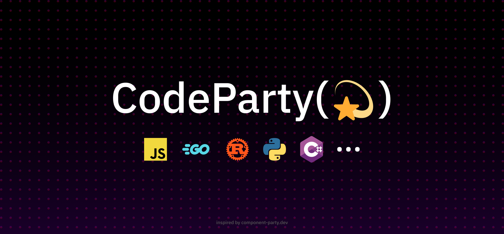

# 

# Code Party - Compare Coding Languages & Approaches

**Code Party** is an open-source platform designed to help developers compare different programming languages by showcasing how they handle simple tasks, such as printing to the console, and more complex algorithms, like Breadth-First Search (BFS) and Depth-First Search (DFS). By illustrating language-specific syntax and approaches side-by-side, **Code Party** makes it easier to understand how different languages function, and how to use them more effectively.

It is also inspired by the great tool [Component Party 🎉](https://component-party.dev)!

## Features

- **Side-by-Side Code Comparisons**: View examples of how various languages approach the same task.
- **Common Algorithms & Tasks**: Explore how algorithms like BFS, DFS, sorting, and more are implemented in different languages.
- **Learn by Example**: See code snippets for simple tasks like printing to the console or handling loops, variables, and more.
- **Expand Your Knowledge**: Discover how languages handle key programming constructs differently, helping you become a more versatile developer.

## How It Works

- **Simple Problems**: Each comparison includes basic problems like "Hello World!" or simple input/output tasks.
- **Common Algorithms**: Look at more complex implementations such as BFS, DFS, and sorting algorithms in various languages.
- **Code Snippets**: Each problem is presented with side-by-side code snippets for different languages (e.g., Python, JavaScript, C++, Java).

## Supported Languages

- Python
- JavaScript
- C++
- Java
- Go
- Rust
- Ruby
- And more!

## Contributing

We welcome contributions from the community! Here's how you can get involved:

1. Fork the repository.
2. Add your language’s implementation for a task or algorithm.
3. Submit a pull request with your changes for review.

## License

Code Party is licensed under the MIT License.
